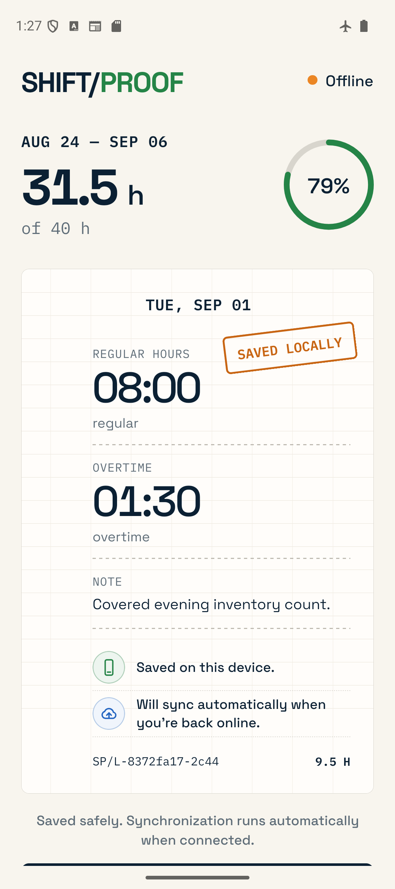
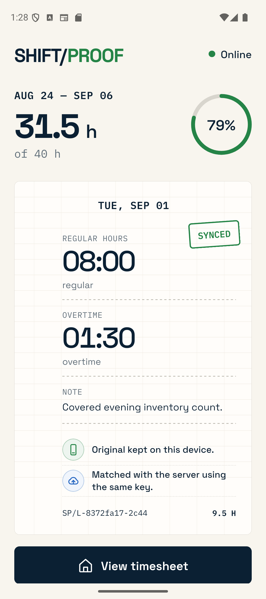
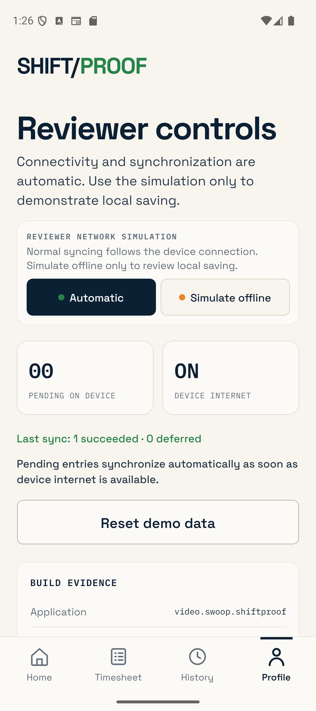
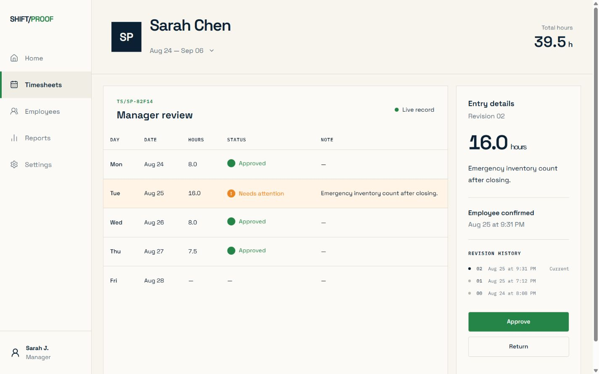
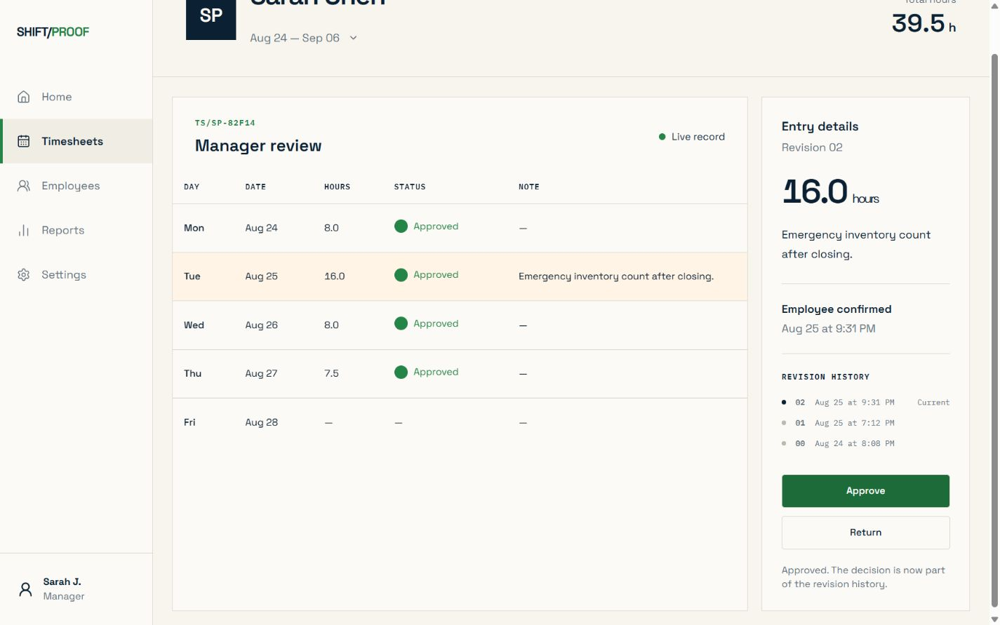

# ShiftProof

**Hours worked. Proof earned.**

ShiftProof is an independent, offline-first timecard engineering demo. It follows one employee entry from a durable Android save, through safe synchronization and human review, to an API-issued approval receipt.

It is a portfolio project, not a Wagepoint product. Wagepoint did not commission, sponsor, or approve it. All people, dates, hours, notes, identifiers, and review decisions in the demo are synthetic.

## Review the finished build

- [Live case study](https://shiftproof.swoop.video)
- [Live manager review](https://shiftproof.swoop.video/review)
- [Download the Android reviewer APK](https://github.com/yazanbaker94/shiftproof/releases/latest/download/shiftproof-release-arm64-v8a.apk)
- [Browse the source and documentation](https://github.com/yazanbaker94/shiftproof)

The Android APK is an ARM64 reviewer build for modern physical Android devices. It uses the same HTTPS API deployment as the manager review, while each mobile-created record gets an isolated reviewer ledger so the shared public scenario remains deterministic.

## What to review

| Surface | Role in the demo | What it proves |
| --- | --- | --- |
| `apps/mobile` | Employee Android app | SQLite durability, automatic connectivity-aware synchronization, a persisted retry queue, stable request IDs, and accessible status marks |
| `apps/api` | Fastify service | Validated REST commands, idempotent creates, operation recovery, review decisions, and append-only evidence |
| `apps/web` | Case study and manager ledger | A reviewer can inspect the unusual entry and approve or return it; the UI labels whether it is using the API or an isolated preview |
| `packages/contracts` | Shared vocabulary | Zod schemas and TypeScript types for entries, timesheets, operations, revisions, and events |
| `infra` | Deployment path | PostgreSQL, API, web, and Caddy services with health checks and bounded container resources |

The design is intentionally narrow: one reliable workflow is implemented end to end instead of presenting a broad mock payroll suite.

## The 90-second flow

1. In **Profile → Reviewer controls**, choose **Simulate offline**. This control is intentionally kept out of the employee's normal workflow.
2. Add or edit hours and save. SQLite commits the entry and its outbound operation in one transaction.
3. The app shows a local proof slip only after that transaction completes.
4. Choose **Automatic** again. If the device has internet, the queued command synchronizes without a manual button and uses the same idempotency key on every retry.
5. Load or record the `16.0 h` example. ShiftProof flags it using an explicitly demo-only review heuristic.
6. Add context and submit the entry for review.
7. In the web manager ledger, inspect the entry and choose **Approve** or **Return**.
8. When the web ledger is connected to the API, that decision appends a revision and event; approval also creates a stable receipt ID and timestamp.

For the exact reviewer path and the meaning of each mode, see [Reviewer demo script](docs/demo-script.md). For persistence and recovery details, see [Architecture](docs/architecture.md).

## Verified evidence

| Offline save on Android | Confirmed automatic synchronization | Reviewer-only network simulation |
| --- | --- | --- |
|  |  |  |

| Manager review | Approval recorded |
| --- | --- |
|  |  |

## What is implemented

- React Native/Expo screens and navigation for the employee workflow
- SQLite storage using WAL mode
- Atomic local entry + sync-operation writes
- A durable queue with `PENDING`, `SYNCING`, `WAITING_RETRY`, and `SUCCEEDED` states
- Exponential retry delays and recovery of an interrupted `SYNCING` operation
- Client-generated UUIDs and stable idempotency keys
- API request validation and same-key/same-payload replay
- Rejection of the same key with a different payload
- In-memory and PostgreSQL API repositories
- Append-only timesheet events and revisions
- Connected manager approve/return commands, plus a clearly labeled browser-only preview fallback
- API tests for replay, key collision, unusual-hours review, confirmation, approval, and return

## What is seeded or illustrative

The Sarah Chen scenario, pay period, `16.0 h` entry, manager identity, notes, and dashboard totals are deterministic demo data. The `16 h` threshold is a product demonstration heuristic—not payroll advice, an overtime rule, or a statement about Canadian employment law.

Runtime behavior depends on configuration:

- **Mobile without `EXPO_PUBLIC_API_URL`:** SQLite and the queue are real, but synchronization uses an on-device demo response. No remote server is contacted.
- **Mobile with `EXPO_PUBLIC_API_URL`:** create, recovery, confirm, and reconciliation use the REST API.
- **API without `DATABASE_URL`:** the in-memory repository is real process state but resets when the API restarts.
- **API with `DATABASE_URL`:** PostgreSQL stores operations, entries, events, revisions, and decisions across restarts.
- **Web with an available API:** the ledger reads and mutates the API record and displays **Live record**.
- **Web without an available API:** it displays **Isolated preview**; approve/return changes only browser state and disappears on refresh.

The polished mobile approval-receipt screen is part of the seeded scenario. The API does issue a real `receiptId` and `approvedAt` value after a connected approval, and mobile reconciliation stores the returned receipt ID, but the current receipt screen's display copy uses fixed demo values.

## Repository map

```text
apps/mobile         React Native employee app
apps/api            Fastify API and PostgreSQL migrations
apps/web            Case study and manager review ledger
packages/contracts  Shared request/response schemas
docs                Architecture, demo script, design system, screenshots
infra               Container and reverse-proxy configuration
```

Private visual references are intentionally excluded from version control. Recruiter-facing evidence belongs in `docs/screenshots`, not in the internal reference folder.

## Run locally

Requirements: Node.js 22.13+, npm, Java 17, and an Android SDK for native Android builds. PostgreSQL is optional; the API uses an in-memory repository when `DATABASE_URL` is absent.

Install each workspace:

```bash
npm --prefix packages/contracts install
npm --prefix apps/api install
npm --prefix apps/web install
npm --prefix apps/mobile install
```

Build the shared contracts, then start the API:

```bash
npm run contracts:build
npm run api:dev
```

For a connected local manager ledger, create an untracked `apps/web/.env.local` containing:

```dotenv
NEXT_PUBLIC_API_BASE_URL=http://localhost:4100
```

Then start the web app:

```bash
npm run web:dev
```

For an Android emulator to reach the API running on the host machine, create an untracked `apps/mobile/.env.local` containing:

```dotenv
EXPO_PUBLIC_API_URL=http://10.0.2.2:4100
```

Use the host's LAN address instead of `10.0.2.2` for a physical Android device. Then run:

```bash
npm run mobile:start
```

## Validate and build the APK

Run the repository checks:

```bash
npm run check
```

Build an emulator debug APK or an ARM64 reviewer APK:

```bash
npm --prefix apps/mobile run android:debug:x86_64
npm --prefix apps/mobile run android:reviewer:arm64
```

The build script writes generated APKs under `apps/mobile/dist/android/`. APKs are intentionally ignored by Git; the verified reviewer binary and its SHA-256 checksum are attached to the latest GitHub Release.

## Privacy and product boundary

ShiftProof contains no real employee, payroll, customer, or Wagepoint data. It records time evidence and review decisions; it does not calculate wages, taxes, statutory overtime, eligibility, remittances, or payroll results.
